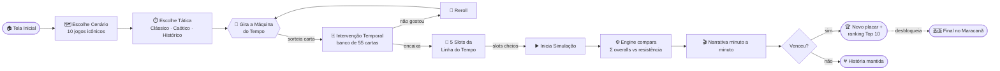
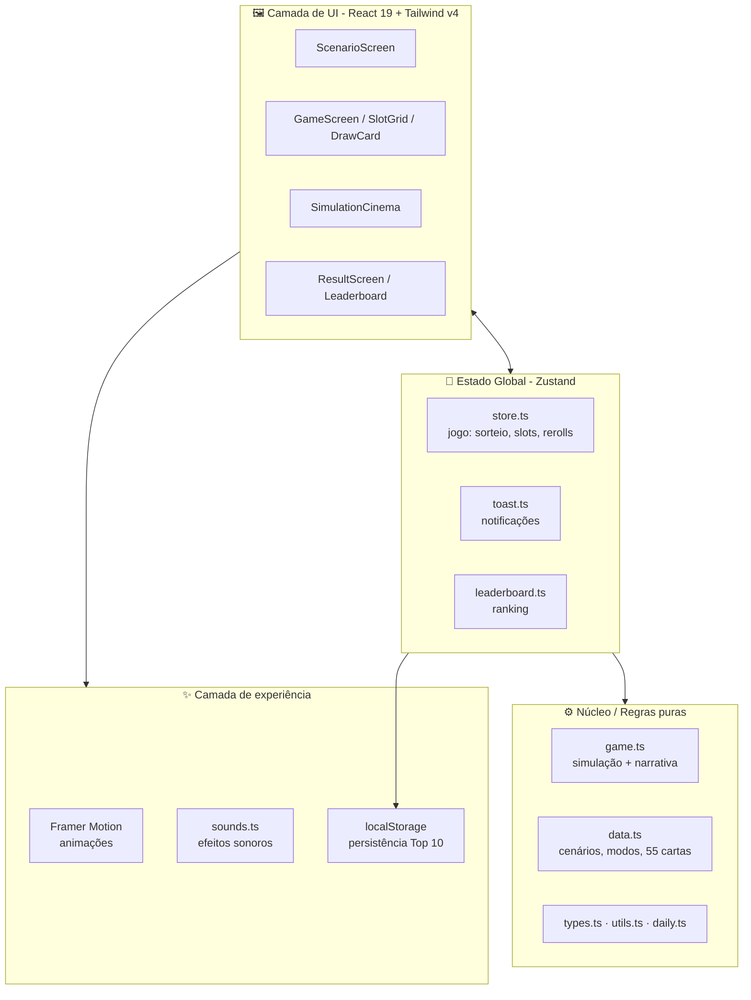

# 📣 Post para o LinkedIn — Máquina do Tempo do Futebol

> Arquivo pronto para copiar/colar. Abaixo você encontra **3 versões do texto**
> (curta, média e técnica), **um diagrama ilustrativo** do projeto e dicas de
> publicação. Escolha a versão que mais combina com o seu objetivo.

---

## ✅ Versão 1 — Curta e direta (storytelling)

> E se você pudesse **voltar no tempo e mudar o placar** dos jogos mais
> traumáticos da história do futebol? 🕹️⚽
>
> Foi essa ideia que virou o meu novo projeto: a **Máquina do Tempo do
> Futebol** — um jogo de estratégia onde você assume o papel de um viajante
> temporal e reescreve momentos icônicos (sim, o 7x1 está lá 🇧🇷).
>
> A mecânica é simples e viciante:
> 🎰 Você gira a máquina e sorteia "Intervenções Temporais"
> 🧩 Encaixa as cartas nos 5 slots da linha do tempo
> ▶️ Roda a simulação e vê a narrativa do jogo se desenrolar minuto a minuto
>
> Construí tudo com **Next.js 15, React 19, TypeScript, Zustand e Framer
> Motion**. Foi um exercício incrível de game design + front-end moderno.
>
> 👉 Bora reescrever a história? Comenta aí qual jogo você mudaria. ⚽👇
>
> #futebol #gamedev #react #nextjs #typescript #frontend #desenvolvimento

---

## ✅ Versão 2 — Média (produto + processo)

> 🚀 Acabei de finalizar um projeto que une duas paixões: **futebol e código**.
>
> Apresento a **Máquina do Tempo do Futebol** — um jogo de estratégia/simulação
> onde você é um "viajante temporal" e tenta reescrever os momentos mais
> traumáticos da história do futebol mundial.
>
> 🎯 **Como funciona:**
> 1. Você escolhe um dos 10 cenários icônicos (ex: Brasil 7x1 Alemanha)
> 2. Define a tática de tempo (Clássico, Caótico ou Histórico)
> 3. Gira a máquina e sorteia cartas de "Intervenção Temporal" — um banco de
>    55 cartas baseadas em anedotas e lendas do futebol
> 4. Encaixa as cartas nos 5 slots da linha do tempo
> 5. Roda a simulação: a soma dos overalls enfrenta a resistência do adversário
>    e a narrativa do jogo aparece lance a lance
>
> Vencer o Brasil 2014 desbloqueia a final no Maracanã — a campanha continua. 🏆
>
> 🛠️ **Stack técnica:**
> • Next.js 15 (App Router) + React 19 + TypeScript
> • Zustand para estado global do jogo
> • Framer Motion para as animações (giro das cartas, narrativa, celebrações)
> • Tailwind CSS v4 com tema customizado
> • Ranking local (Top 10) em localStorage
>
> O mais legal foi transformar um GDD (game design document) em um produto
> jogável de verdade — pensando em UX, feedback visual, som e progressão.
>
> Qual jogo da história você reescreveria? 👇
>
> #gamedev #react #nextjs #typescript #frontend #futebol #webdevelopment #ux

---

## ✅ Versão 3 — Técnica (para recrutadores/devs)

> 🧩 **Estudo de caso:** como transformei um game design document em um jogo
> web completo com Next.js 15 e React 19.
>
> O projeto **Máquina do Tempo do Futebol** é um jogo de simulação onde o
> jogador reescreve resultados históricos do futebol combinando cartas em uma
> linha do tempo de 5 slots.
>
> 🏗️ **Decisões de arquitetura que valem comentar:**
>
> • **Estado desacoplado com Zustand** — toda a lógica de jogo (sorteio,
>   rerolls, slots, simulação) vive em stores isolados (`store.ts`, `toast.ts`,
>   `leaderboard.ts`), separados da camada de UI.
>
> • **Engine de simulação pura** — `game.ts` recebe o estado e devolve placar +
>   narrativa, sem efeitos colaterais. Isso deixa a regra testável e
>   independente do React.
>
> • **Dados como fonte da verdade** — cenários, modos e o banco de 55 cartas
>   ficam em `data.ts`, então adicionar conteúdo novo não exige tocar na UI.
>
> • **Animação como linguagem** — Framer Motion conduz o giro das cartas, a
>   narrativa minuto a minuto e as celebrações de gol/título, reforçando o
>   feedback do jogador.
>
> • **Persistência leve** — ranking Top 10 em localStorage, com plano de
>   migração para Supabase (backend real) no roadmap.
>
> 📦 Stack: Next.js 15 · React 19 · TypeScript · Zustand · Framer Motion ·
> Tailwind CSS v4
>
> Curtiu a abordagem de separar engine, estado e UI? Comenta que eu detalho. 👇
>
> #softwareengineering #react #nextjs #typescript #architecture #gamedev #frontend

---

## 🖼️ Diagrama ilustrativo

> Cole este bloco no GitHub (README) para renderizar automaticamente, ou use
> um renderizador Mermaid (https://mermaid.live) para exportar como imagem e
> anexar ao post do LinkedIn.

### Fluxo do jogo (visão do jogador)

### Arquitetura técnica (camadas)

---

## 💡 Dicas para publicar

- **Anexe mídia.** Posts com imagem/vídeo performam muito melhor. Grave um
  GIF curto (10-15s) do giro da carta + simulação — é o "momento mágico" do
  jogo. Use a tela com a narrativa minuto a minuto, que é visualmente forte.
- **Exporte o diagrama como imagem.** Cole o bloco Mermaid em
  https://mermaid.live, exporte PNG/SVG e use como primeiro carrossel.
- **Primeira linha = gancho.** O LinkedIn corta o texto em ~3 linhas; a
  pergunta inicial ("E se você pudesse voltar no tempo...") prende a atenção.
- **Carrossel funciona bem:** slide 1 = capa/pergunta, slide 2 = como joga,
  slide 3 = diagrama de arquitetura, slide 4 = stack + CTA.
- **Inclua um link** (deploy na Vercel ou repositório) e peça interação na
  última linha — comentários impulsionam o alcance.
- **Marque** ferramentas/comunidades relevantes (Next.js, React Brasil) se
  fizer sentido.
- Publique em horário de pico (ter-qui, 8h-10h ou 17h-19h).
